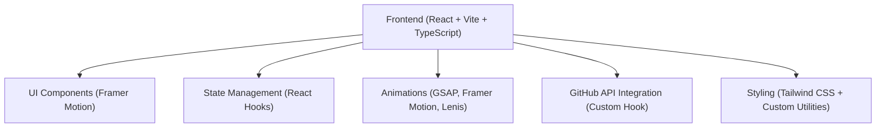

## 1. Architecture Design


## 2. Technology Description
- **Frontend**: React@18 + TypeScript + Vite
- **Styling**: Tailwind CSS@3 + PostCSS + Autoprefixer
- **Animations**: Framer Motion, GSAP, Lenis (smooth scrolling)
- **Icons**: Lucide React
- **Initialization Tool**: Vite
- **Backend**: None (static site)
- **Database**: None (GitHub API for projects, localStorage for theme/visitor counter)

## 3. Route Definitions
| Route | Purpose |
|-------|---------|
| / | Home page with all portfolio sections |

## 4. Project Structure
```
/
├── public/             # Static assets (images, icons, etc.)
├── src/
│   ├── components/     # Reusable UI components
│   ├── hooks/          # Custom React hooks
│   ├── lib/            # Utility functions, constants, configuration
│   ├── sections/       # Page sections (Hero, About, Experience, etc.)
│   ├── types/          # TypeScript type definitions
│   ├── App.tsx         # Main app component
│   ├── main.tsx        # Entry point
│   └── index.css       # Global styles, Tailwind directives
├── .gitignore
├── package.json
├── tsconfig.json
├── vite.config.ts
└── tailwind.config.js
```

## 5. Data Definitions

### GitHub Project Type
```typescript
interface GitHubProject {
  id: number;
  name: string;
  description: string | null;
  html_url: string;
  homepage: string | null;
  stargazers_count: number;
  forks_count: number;
  language: string | null;
  topics: string[];
  updated_at: string;
  archived: boolean;
}
```

### Experience Type
```typescript
interface Experience {
  id: string;
  company: string;
  role: string;
  duration: string;
  technologies: string[];
  responsibilities: string[];
  achievements?: string[];
}
```

### Skill Type
```typescript
interface SkillCategory {
  id: string;
  name: string;
  skills: string[];
}
```

### Certification Type
```typescript
interface Certification {
  id: string;
  title: string;
  organization: string;
  issueDate: string;
  credentialUrl?: string;
}
```

## 6. Configuration Files
- `src/lib/constants.ts`: Centralized configuration (GitHub username, social links, personal info, etc.)
- `src/lib/data.ts`: Static data for experience, skills, certifications (easy to update)
