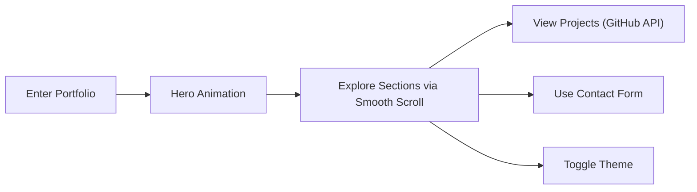

## 1. Product Overview
Sanika Deshmukh's premium, modern, recruiter-focused portfolio showcasing her skills, experience, projects, and achievements as a Full Stack Engineer. Targeted at recruiters and hiring managers from top product companies (Microsoft, Google, Amazon, Atlassian, Adobe, Salesforce, etc.), designed to stand out with exceptional UI/UX, animations, and production-grade code.

## 2. Core Features

### 2.1 User Roles
| Role | Registration Method | Core Permissions |
|------|---------------------|------------------|
| Visitor | None | Browse portfolio, view projects, use contact form, switch themes |

### 2.2 Feature Module
1. **Home page**: Hero section, floating navbar, scroll progress indicator, social links, visitor counter
2. **About section**: Personal introduction, background story
3. **Experience timeline**: Animated, interactive timeline of professional experience
4. **Skills section**: Categorized, animated skill cards
5. **Projects section**: Dynamically fetched GitHub projects with search/filter/sort, loading skeletons
6. **Certifications section**: Premium certification cards
7. **Contact section**: Split layout contact info and animated contact form
8. **Footer**: Site links, copyright

### 2.3 Page Details
| Page Name | Module Name | Feature description |
|-----------|-------------|---------------------|
| Home page | Hero section | Animated text, dynamic role display, magnetic buttons, social links, CTA buttons, visitor counter, animated visual/illustration |
| Home page | Navigation | Floating navbar, active section highlighting, theme toggle, smooth scroll links |
| Home page | About section | Personal background, introduction, visual design |
| Home page | Experience timeline | Animated cards alternating sides, detailed experience info, tech stack tags |
| Home page | Skills section | Categorized animated skill cards, hover effects |
| Home page | Projects section | GitHub API integration, search/filter/sort, loading skeletons, premium project cards with hover effects |
| Home page | Certifications section | Certification cards with hover animations, credential links |
| Home page | Contact section | Split layout (contact info + form), animated inputs, validation, success state |
| Home page | Footer | Copyright, quick links |

## 3. Core Process
Visitor navigates to portfolio → experiences hero entrance animation → explores sections via smooth scroll → views dynamically fetched projects → uses contact form to reach out → can switch between light/dark themes.

## 4. User Interface Design
### 4.1 Design Style
- **Primary colors**: #2563EB (Blue), #0F172A (Dark Slate)
- **Accent colors**: #38BDF8 (Light Blue), #10B981 (Green)
- **Buttons**: Rounded (12px), hover lift, magnetic effect, subtle glow
- **Fonts**: Syne (display), Inter (body)
- **Layout style**: Card-based, glassmorphism, asymmetric, generous whitespace
- **Icons**: Lucide React, custom SVG icons
- **Backgrounds**: Mesh gradients, floating gradient blobs, animated particles, subtle grid lines

### 4.2 Page Design Overview
| Page Name | Module Name | UI Elements |
|-----------|-------------|-------------|
| Home page | Hero section | Full viewport height, animated text (GSAP), magnetic buttons (Framer Motion), floating gradient blobs, animated developer illustration, social icons with hover effects |
| Home page | Experience timeline | Vertical timeline, cards animate in from alternate sides on scroll, glassmorphism cards, hover elevation, tech tags |
| Home page | Projects section | Responsive grid, glassmorphism project cards, animated loading skeletons, search/filter bar, hover lift/glow, click to open GitHub repo |
| Home page | Skills section | Categorized skill cards, animated skill bars, hover animations |
| Home page | Contact section | Split layout, animated form inputs, validation states, success animation |

### 4.3 Responsiveness
Desktop-first, fully adaptive for laptop, tablet, mobile, large screens, and ultra-wide monitors. No overflow or broken layouts.

### 4.4 Performance Optimization
Lazy load components, lazy load images, memoization, optimized animations, excellent Lighthouse scores (90+ in all categories).
